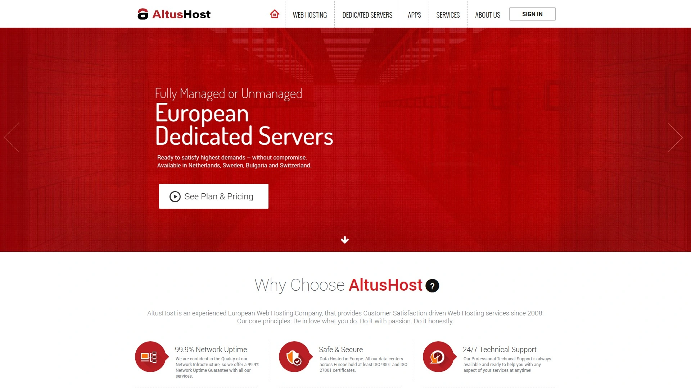
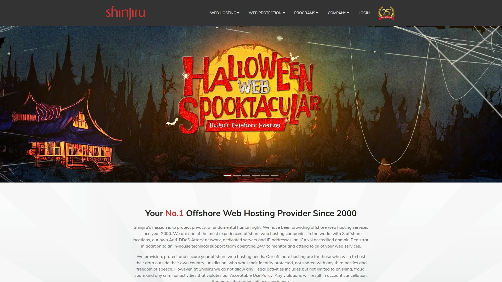
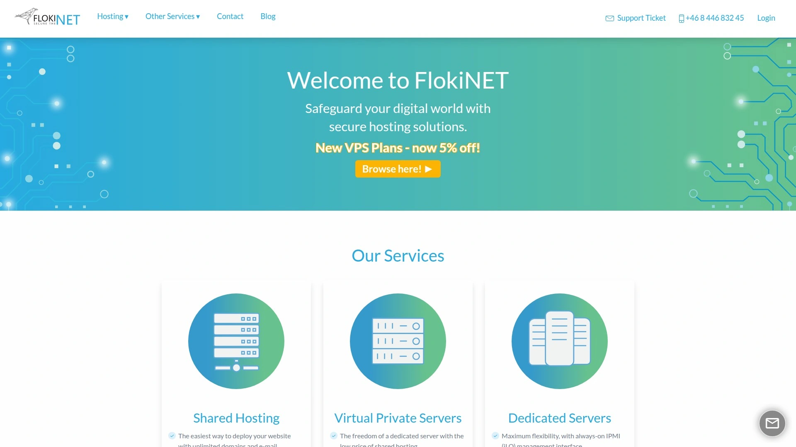
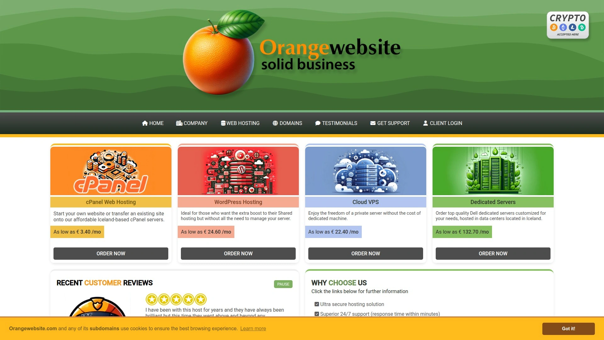
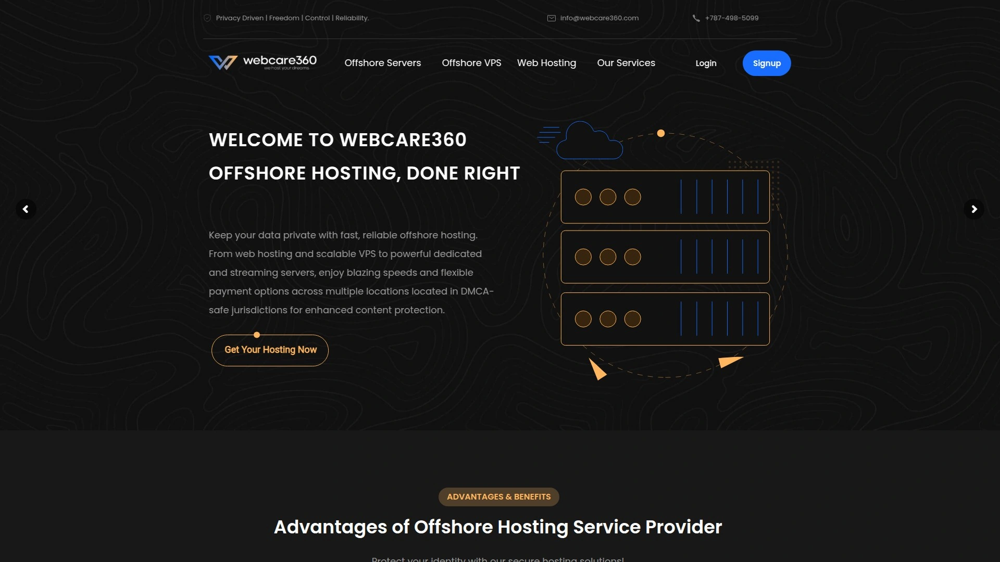
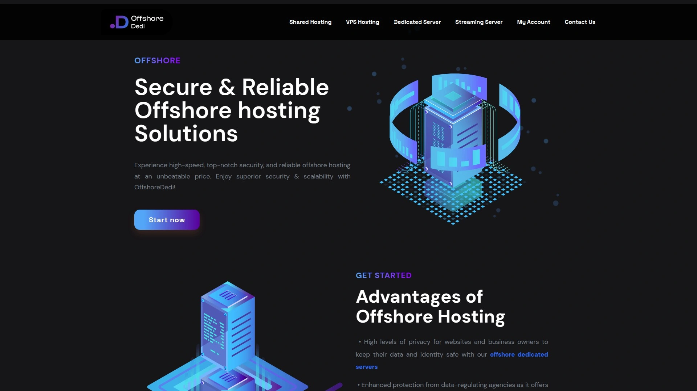
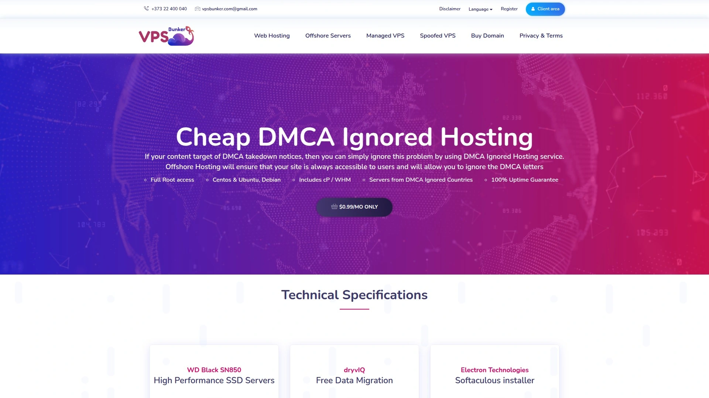
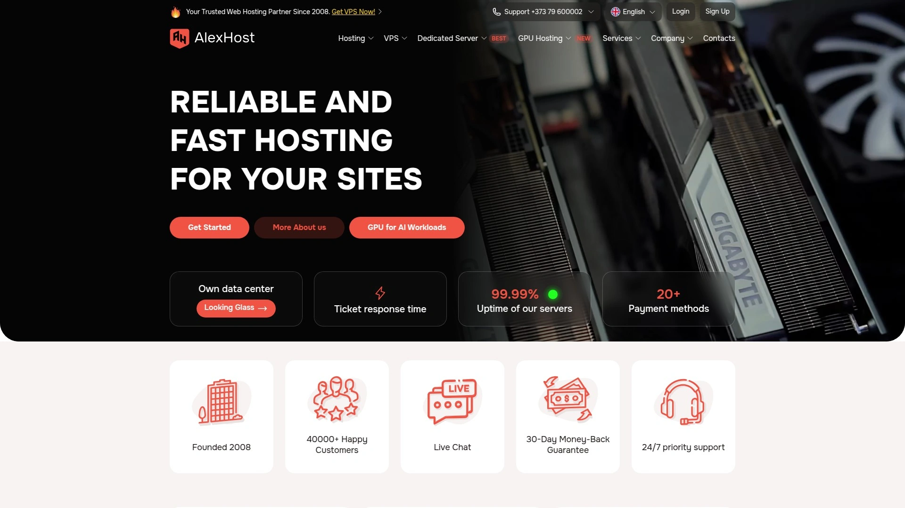
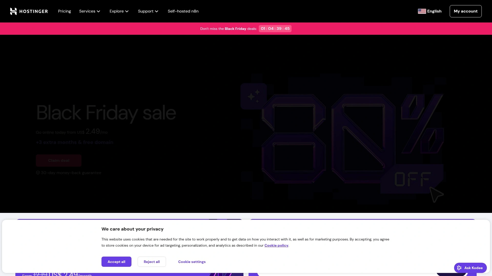
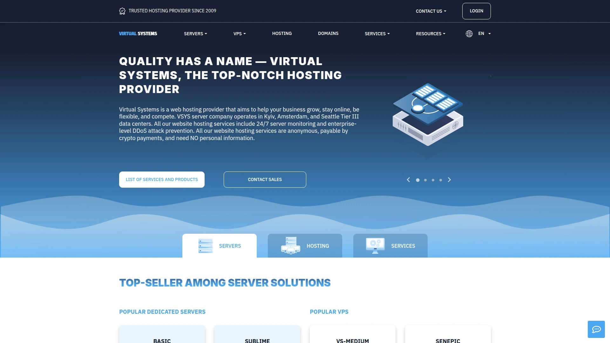

# 2025年排名前18的海外主机服务商盘点(最新整理)

服务器被频繁投诉下线、内容审查让业务处处受限、数据隐私得不到保障——这些问题在传统主机商那里几乎无解。海外主机服务商通过把服务器部署在隐私法规宽松的国家,能够为你提供更强的内容自由度、更严格的数据保护和更灵活的运营空间。这份榜单覆盖了从荷兰、冰岛到马来西亚的18家成熟服务商,它们的共同特点是:数据中心位于离岸司法管辖区、支持匿名注册和加密货币支付、提供从共享主机到独立服务器的完整方案。无论你是需要规避内容审查的媒体平台,还是对隐私保护有严格要求的企业应用,都能在这里找到合适的选择。

## **[AltusHost](https://altushost.com)**

总部位于荷兰阿姆斯特丹的欧洲老牌主机商,专注提供符合GDPR标准的高隐私托管方案。

AltusHost成立于2008年,是欧洲市场上口碑稳定的隐私主机提供商。公司总部和主要数据中心都设在荷兰,同时在瑞典斯德哥尔摩和法国也有节点覆盖。这三个国家都有严格的数据隐私保护法规,天然适合需要规避美国DMCA法案管辖的内容托管。

技术架构方面,共享主机全部采用CloudLinux操作系统和LiteSpeed网络服务器,硬盘配置为RAID-10阵列,这套组合在速度和可靠性上表现优异。VPS方案提供Linux和Windows两种系统,免费包含IPv4和IPv6地址、每周自动备份以及最低1TB的优质带宽。独立服务器可选荷兰、瑞典或法国机房,最低配置从i3处理器起步,RAM在4到16GB之间。

数据中心获得ISO 27001认证,这是信息安全管理的国际标准。所有共享主机计划都包含免费DDoS防护、每日备份和免费站点迁移服务。客服提供24/7在线聊天支持,不仅处理销售问题,技术咨询也能通过即时聊天解决。

定价策略透明但续费会涨价。共享主机从每月5.69美元起,年付有15%折扣。VPS起步价每月19.99美元(2核心、1TB流量),高配方案在34.95到69.96美元之间。独立服务器基础款月费149到299美元,但有50美元初装费;特价促销区经常有无初装费的服务器,价格从79美元起。共享主机提供45天退款保证,VPS是14天,但独立服务器明确不退款。

## **[Shinjiru](https://www.shinjiru.com)**

马来西亚老牌离岸主机商,自2000年起提供DMCA豁免托管,支持完全匿名注册和加密货币付款。

Shinjiru是行业内最受信任的离岸主机品牌之一。公司总部设在马来西亚,运营受马来西亚法律管辖而非美国法律,这让它能够合法地忽略DMCA版权投诉和政府监控请求。数据中心战略性地分布在马来西亚、荷兰、俄罗斯和保加利亚——这些国家的数据隐私法规都相对宽松。

核心服务包括离岸VPS、独立服务器、共享主机、域名注册和防弹主机解决方案。最大的特色是**匿名注册政策**:你可以不提供真实身份信息就开设账户,接受比特币等加密货币支付,整个过程完全不留追踪痕迹。这对数字维权人士、内容创作者和需要言论自由保障的组织尤其重要。

Shinjiru在全球有8个服务器位置可选,包括亚洲、欧洲和北美。提供cPanel控制面板、免费SSL证书和24/7客户支持。Trustpilot上有230条评价,用户主要称赞其隐私保护政策和服务稳定性。定价从共享主机每月3.95美元起步,VPS和独立服务器根据配置差异较大。

适合需要强法律韧性、对抗版权投诉和保护数据安全的业务场景。虽然价格不是最便宜的,但在隐私保护的完整性和服务的长期稳定性方面值得信赖。

## **[FlokiNET](https://flokinet.is)**

冰岛独立主机服务商,专注安全、稳定和匿名托管,数据中心100%使用可再生能源供电。

FlokiNET的服务器全部位于冰岛,这个北欧岛国以强大的言论自由保护和严格的隐私法规闻名。冰岛不受美国DMCA法案管辖,也不参与五眼、九眼或十四眼情报共享联盟,是全球隐私托管的理想司法管辖区。

提供共享主机、VPS和独立服务器三类产品。所有服务器运行在地热和水力发电的数据中心,完全依靠可再生能源,这对环保意识强的用户是额外加分项。技术配置包括DDoS防护、每日备份、免费SSL证书和多种操作系统选择。

VPS方案支持Linux和Windows系统,提供root/管理员访问权限,适合需要完全控制服务器环境的开发者。共享主机采用cPanel面板,对新手友好。独立服务器可定制配置,从入门级到高性能方案都有覆盖。

FlokiNET接受信用卡、PayPal和比特币等多种支付方式。在Reddit的webhosting社区有讨论,用户主要关注其隐私保护政策和冰岛的法律优势。HostAdvice上有40条用户评价,整体评分为正面。适合需要最高等级隐私保护、内容自由度和环保认证的项目。

## **[OrangeWebsite](https://orangewebsite.com)**

冰岛绿色能源主机商,自2009年起提供基于言论自由保护的托管服务,服务客户遍布100多个国家。

OrangeWebsite成立于2009年,所有托管设施都位于冰岛,运行在100%可再生能源上。冰岛的言论自由立法和数据隐私法规为内容提供了天然的法律保护屏障。虽然总部在冰岛,但客户来自超过100个国家,证明其服务的国际适用性。

提供四种托管方案:共享主机适合个人和中小企业网站,VPS(Linux和Windows)提供独立服务器级别的自由度但成本更低,独立服务器则是性能需求大的用户的首选。所有共享主机计划都受到最新安全方案保护,包含DDoS攻击防护。

独立服务器可免费预装最新版操作系统(Windows除外),帮你快速启动项目。VPS和独立服务器都能充分利用冰岛的隐私和言论自由法规优势。24/7全年无休的客服团队由经验丰富的专家组成,随时在线提供技术支持。

定价信息需要访问官网查看具体套餐。适合对绿色能源、言论自由和数据隐私有明确需求的用户,特别是来自内容审查严格地区的媒体、博客和内容平台。Reddit上有讨论帖询问其可靠性,整体反馈偏向正面。

## **[WebCare360](https://webcare360.com)**

专业DMCA豁免主机服务商,提供从共享到独立服务器的全系列离岸托管方案,承诺99.99%在线时间。

WebCare360专注于DMCA豁免托管已有十多年历史。服务器全部部署在非美国的离岸地区,确保不受美国版权法约束。核心优势在于**安全、匿名和性能优化**的平台架构,让客户能安心托管内容而不用担心DMCA投诉导致下线。

托管类型包括DMCA豁免共享主机、VPS和独立服务器。所有服务器采用超快的NVMe SSD存储,基础共享方案就包含5GB NVMe SSD、500GB月流量、2个网站、2个邮箱、2个数据库,以及免费Cloudflare CDN访问。更高配置的套餐流量可达1TB到1.5TB,存储从10GB到15GB不等。

安全功能包括DDoS保护、实时监控和定制防火墙规则。数据备份存储在不同数据中心以提供额外保护。提供7天退款保证和99.99%在线时间承诺。客户支持24/7通过在线聊天、邮件和电话提供。

离岸共享主机起步价每月3.99美元,中级套餐5.99美元/月,高级套餐9.99美元/月。VPS方案从每月99.99美元起,具体配置不明。适合流媒体网站、托管敏感内容或频繁遭遇投诉干扰的业务。

## **[OffshoreDedi](https://offshorededi.com)**

专注离岸独立服务器和DMCA豁免托管的专业服务商,提供高度定制化的解决方案。

OffshoreDedi的名字直接点明了核心业务:离岸独立服务器。这类服务特别适合有大流量、高性能需求,同时需要规避内容审查的项目。独立服务器意味着你独享所有硬件资源,不与其他用户共用CPU、内存或带宽。

服务器位置选择多样,覆盖欧洲和亚洲的多个非DMCA管辖区。所有方案都支持DMCA豁免,服务商会按照本地法律处理投诉而非立即下线内容。这种处理方式给了客户申诉和反驳的机会,避免了滥用投诉带来的业务中断。

独立服务器可根据需求定制配置,从处理器型号、内存容量到存储类型都能灵活选择。提供完全的root访问权限,允许安装任何合法软件和配置环境。带宽通常是不限流量或超大配额,满足高流量应用的需求。

定价根据配置差异较大,需要联系销售获取报价。适合运营大型内容平台、视频流媒体、文件分享服务或任何需要稳定大带宽和内容保护的应用。

## **[VpsBunker](https://www.vpsbunker.com)**

专业离岸VPS提供商,100% DMCA豁免保障,服务器位于隐私法规友好的国家。

VpsBunker专注于VPS托管,明确承诺100% DMCA豁免。VPS(虚拟专用服务器)是介于共享主机和独立服务器之间的方案,提供独立的资源配额但成本远低于独立服务器。你会获得root访问权限、独立IP地址和可自定义的服务器环境。

服务器部署在隐私保护强的离岸司法管辖区,具体位置包括东欧和亚洲的多个国家。这些地区不执行美国DMCA法案,也不参与国际数据共享协议。所有VPS方案都包含DDoS保护、定期备份和24/7技术支持。

配置选项灵活,从入门级1核心、512MB内存到高性能8核心、32GB内存都有覆盖。存储类型可选传统HDD或高速SSD,带宽从100Mbps到1Gbps不限流量。操作系统支持多种Linux发行版和Windows Server。

VPS方案起步价通常在每月10到20美元之间,具体取决于配置和服务器位置。接受信用卡、PayPal和比特币等支付方式。适合需要中等规模资源、完全控制权和内容自由度的开发者和企业。

## **[AlexHost](https://alexhost.com)**

专业DMCA豁免托管服务商,数据中心分布在欧洲和亚洲多个隐私友好国家。

AlexHost提供全系列的离岸托管产品,从共享主机到VPS再到独立服务器都有覆盖。所有服务都明确标注DMCA豁免,确保你的内容不会因美国版权法投诉而被强制下线。服务器位置包括荷兰、保加利亚、罗马尼亚等欧洲国家,这些地区有独立的数据保护法规。

技术特性包括高速SSD存储、不限流量带宽(部分套餐)、免费SSL证书和cPanel/Plesk控制面板。VPS提供root访问权限,支持自定义安装软件和配置环境。所有方案都包含基础DDoS防护,高级套餐可升级到更强的防护等级。

客户支持通过工单系统、邮件和在线聊天提供,响应时间通常在数小时内。接受信用卡、PayPal和多种加密货币支付,部分套餐支持匿名注册。定期有促销活动,首次购买可享受折扣。

共享主机从每月几美元起步,VPS在20到80美元区间,独立服务器通常100美元以上。适合需要欧洲节点、中等价位和可靠DMCA豁免保障的用户。

## **[Hostinger](https://www.hostinger.com)**

全球知名主机商总部位于立陶宛,提供10个全球服务器位置,价格极具竞争力且性能优异。

Hostinger虽然不是传统意义上的纯离岸主机商,但它的总部设在立陶宛——一个不执行DMCA法案的欧盟国家。公司在全球有10个数据中心,包括美国、英国、立陶宛、法国、德国、荷兰、新加坡、巴西、印度和印度尼西亚。其中法国、德国、英国、荷兰和立陶宛都有严格的隐私法律,非常适合离岸托管需求。

**定价从每月2.69美元起**,是市场上最便宜的高质量主机服务之一。性能方面获得A+评级,在线时间记录为100%。所有域名都包含免费的WHOIS隐私保护,增强整体隐私性。Cloudflare保护的域名服务器能防御DDoS攻击。

注册只需提供最少信息,支持包括预付卡在内的多种支付方式。虽然它不像专业离岸主机那样明确标注DMCA豁免,但立陶宛的司法管辖权本身就是一层天然保护。控制面板hPanel设计现代化,对新手友好。

适合预算有限、需要全球多个节点选择、同时希望获得基础隐私保护的个人站长和中小企业。性价比在同类产品中几乎无敌。

## **[VSYS Host](https://vsys.host)**

美国公司运营的离岸主机服务商,接受比特币付款,提供匿名网络托管方案。

VSYS Host专门提供离岸托管和匿名主机服务。虽然公司注册在美国,但服务器全部部署在海外的非DMCA管辖区。最大的特色是**完全匿名注册**:不需要提供真实姓名、地址或可追踪的付款信息,接受比特币等加密货币支付。

服务类型包括离岸VPS、独立服务器和共享主机。所有方案都允许匿名使用,注册过程不验证身份,系统只记录必要的
